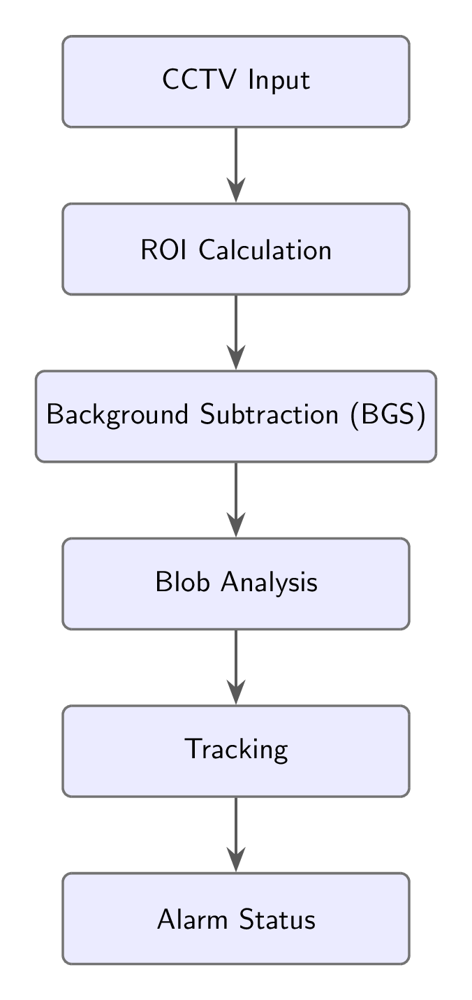

# Grade-cross Monitoring

##### Intro: 

This branch includes work done for the following pipeline:

# Completed Work:

- Researched and implemented background subtraction (BGS) algorithms, specifically ViBe and SuBSENSE.​  

- Implemented the blob detection and analysis component.​
	

- Implemented deepSORT for continious blob tracking.​

    *All updated work and implementations are located in *bgs_playground/deepsort.py*

# Future Work:

- Looking to implement and finalize the  ROI approach.​ 
#### _infer_seg_lines.py_ and _train_rail_seg.py_ were generously provided by University Transportation Center for Railway Safety (UTCRS) @ UTRGV
- Implement the safety logic feature. ​    
- Get some preliminary evaluation metrics when safety feature gets implemented.​
